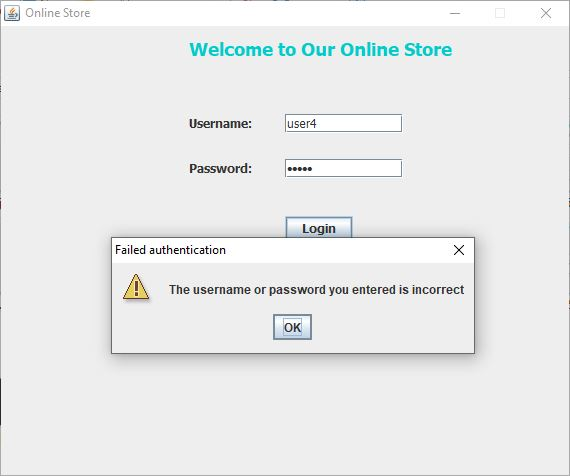
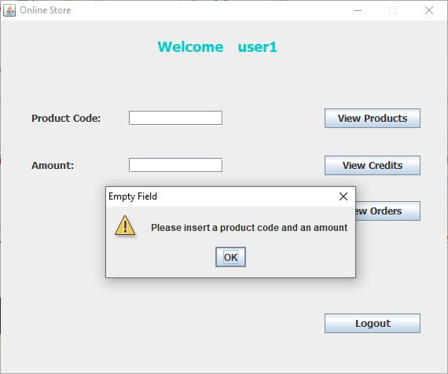

# Distributed Online Store with Java RMI

## Contents
* [Introduction](#anchor1)
* [How install the project and the database in NetBeans](#anchor2)
* [Usage instructions along with screenshots](#anchor3)
* [Error screens](#anchor4)
* [Libraries Dependencies](#anchor5)

##  Introduction

This project concerns a simplified implementation of a distributed online store that follows the client-server model with two servers: i) a client management server and ii) a storage management server. Specifically, the implementation consists of three different Java desktop applications: i) A program for the client called "RMIClient", ii) a program for the client management server called "RMIClientManager", and iii) a program for the storage management server called "RMIStorageManager".

The system makes use of Java RMI technology for the inter-process communication of the above three entities with each other. Also, for our system's needs, we used Apache Derby (in the Network Server framework) as a database, which both the two servers can communicate with (through Derby Network Client JDBC driver) to get and store information about the products, the clients and their orders. Also, note that the system uses secure Sockets over SSL for secure RMI connections between the 3 entities.

Below we give a brief overview of the roles/responsibilities of the two above server entities of this system:
- *RMIClientManager* : This server receives connections from the various clients (through RMI) and is responsible for their authentication. In addition, it has the ability to connect to the system's database to obtain the required information about each user's authentication (i.e. username and password), his available credit balance as well as his orders. Except that, the server communicates with the "RMIStorageManager" (through RMI) to request either a product's purchase or a list of all the available products.

- *RMIStorageManager*: This server receives requests from the "RMIClientManager" for the available products or a product's purchase. However, for the latter request, it must first check whether the user has sufficient credit balance as well as the availability of the product in order to proceed and register the purchase/order. To do that, the server connects with the system's database to get the required information and updates it when a purchase/order occurs.

Our system was implemented to run locally in a machine of x86_64 architecture by assigning the local 127.0.0.1 IP address in each server program. Finally, this project was developed by using the NetBeans IDE platform (v8.2 x64) with JDK 1.8.0_221 x64 installed. Also, we note that with regard to the database, an Apache Derby Network Server (v10.10.2.0) was used which is supported by Netbeans through Glassfish 4.1.1.

##  How install the project and the database in NetBeans

- To install the project in NetBeans:
1. Download the project from Github and decompress it.
2. Copy the 3 subproject folders (i.e. "RMIClient", "RMIClientManager", and "RMIStorageManager") and paste them in your Netbeans project folder.
3. Open Netbeans IDE.
4. Go to File -> Open Projects, select the 3 above project folders (described in step 2) and finally click on "Open Project" button.

- To install the database in NetBeans:
1. In your NetBeans IDE go to Services tab.
2. Double-click on Databases.
3. Right click on Java DB and select Properties.
4. Remember the path of the "Database Location" field.
5. Open your File Explorer and go to that location.
6. Copy the folder "RMIDatabase" included in your decompressed project folder and paste it in the location of step 5.
7. However, if you wish to create your own empty database (without data) the "create_db.sql" file is included in our project folder. There, you can see the SQL commands we used for creating the necessary tables, as shown in the image below.

- (Optional) To create a connection to that database:
1. Right-click on "Databases" and select "New Connection".
2. Select "Java DB (Network)" as a driver and click next.

3. Fill in the next form as described in the below screenshot and click on "Next". Note that the password is "12345" and the username "App".

4. Select the "APP" schema and click on "Next".

5. Click on "Finish".

- Before you run the 3 apps of our system you have to start Apache Derby Network Server first:
1. Go again to Services (tab) -> Databases.
2. Right-click on Java DB and click on "Start Server" choice.

- Now you are ready to run the project in NetBeans by following the sequence below:
1. Run the "RMIStorageManager" application.

2. Run the "RMIClientManager" application.

3. Run the "RMIClient" application.

4. If you want to run the corresponding .jar files of these apps from the command line, be sure that you have made a copy of the 3 corresponding policy, keystore and truststore files of each application into the location where each .jar file is created. This must be done after each subproject has been built in the NetBeans IDE.

##  Usage instructions along with screenshots

Fill in the required username and password to login to the system and click on "Login" button. The current database contained in our project has three users (i.e. "user1", "user2", and "user3"). Note that the password is the same as the username for each user.

Click on the message's "OK" button to proceed.

If you click on "View Credits" button, you can see the available credit balance of this user (i.e. "user1").

If you click on "View Products" button, you can see all the available products of this online store.

If you click on "View Orders" button, you can see all the purchases that this user has made.

If the user wishes to make a purchase, he has to fill in the code of an existing product as well as the desired amount, and finally click on "Place Order" button to proceed to the purchase.

If the purchase is successful, then a relevant message appears on the screen, otherwise an error message will appear. You can see all the relevant error messages in the next section.

Then, we can check if the order was registered successfully by clicking again on "View Orders" button.

Also, we can check whether the user's credit balance was decreased properly by clicking again on "View Credits" button.

Furthermore, we can check whether the quantity of the product has decreased properly by clicking on "View Products" button.

Finally, the user can logout from the system by clicking on the "Logout" button.

Then, the user clicks on the message's "OK" button to return back to the login window.

Finally, the user can shut down the "RMIClient" application by clicking on the "X" button on the top right.

##  Error screens

The user cannot leave blank the "Username" and "Password" fields in order to login to the system.

This message appears when the user has not entered correctly his username or password.

This message appears when the user has clicked on "Place Order" button and left blank the "Product Code" or/and "Amount" fields.

This message appears when the product code does not correspond to an existing warehouse product.

This message appears when the user wants to purchase a specific quantity of product that is not available in stock.

This message appears when the user wants to buy a certain amount of product and his credit balance is insufficient.

This message appears when the user is already connected to the system.

##  Libraries Dependencies

In the "lib" folder of each subproject/application you can see the required libraries.
